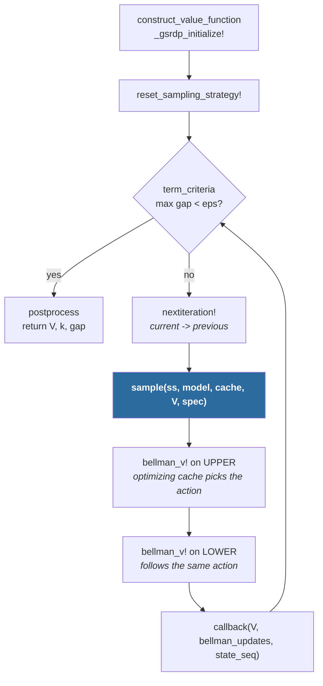
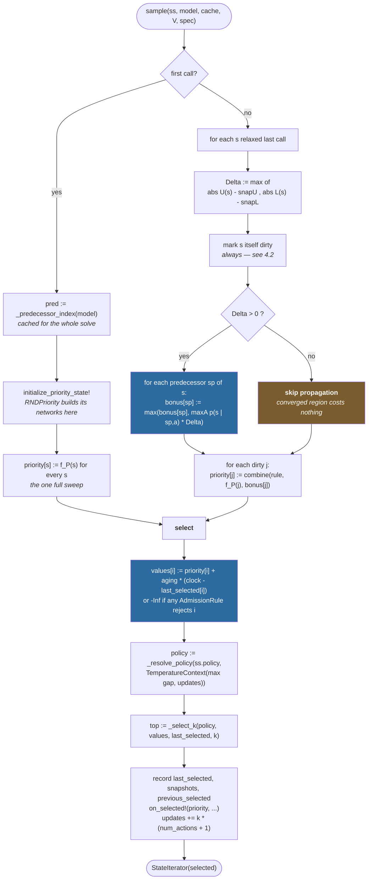
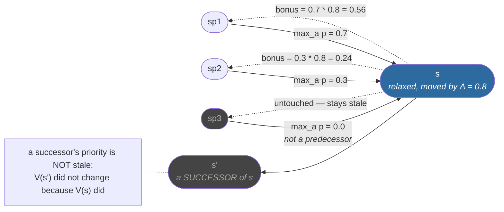
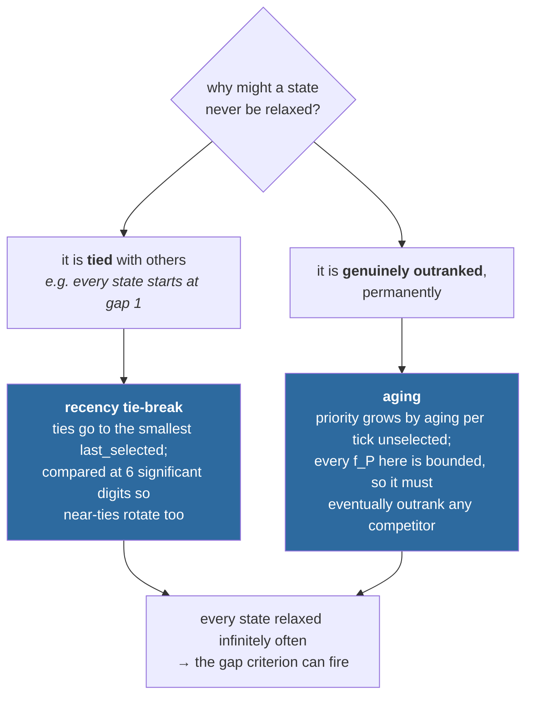
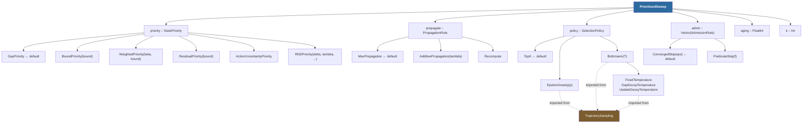

# Priority-queue sampling for GSRDP

A design note on `src/prioritysweeping.jl` — what it replaces, why, and how it works.

> **Scope.** This is a note about the sampler, not about GSRDP itself. It assumes
> you know what `GeneralizedSamplingbasedRobustDynamicProgramming` does: drive an
> `IntervalValueFunction` (simultaneous lower and upper bounds) to a fixed point by
> relaxing a *subset* of states each iteration, and stop when the bracket closes.

---

## 1. What changed

`IntervalMDP.PriorityQueueSampling` used to hold four fixed strategies, each a struct
redeclaring the same seven `Ref` fields around one hardcoded scalar formula. It now holds
one configurable strategy, `PrioritizedSweep`, built from a product of orthogonal choices —
the same shape `TrajectorySampling` was reworked into.

| File | Change |
|---|---|
| `src/prioritysweeping.jl` | **New.** The whole sampler. |
| `src/sampling.jl` | −603 lines: §5b/§5c removed. The `PriorityQueueSamplingStrategy` category, `compute_priority`, and the O-max / predecessor primitives stay, because the trajectory sampler shares them. |
| `src/IntervalMDP.jl` | Include after `trajectorysampling.jl`, so the new module can import that one's policies and temperature schedules by name. |
| `test/base/prioritysweeping.jl` | **New**, 910 lines. The priority-queue tests moved out of `gensampling.jl` and were restructured to mirror `test/base/trajectorysampling.jl`. |
| `docs/src/reference/solve.md` | +87 lines. The concrete strategies previously had no API docs at all. |

The four old constructors survive as deprecated one-liners, so existing call sites keep
working — see [§8](#8-migration).

---

## 2. Why a queue, and not just more trajectories

The decisive fact is the termination criterion. `restrict_to_initial` defaults to `false`
(`src/specification.jl:12`), so GSRDP stops on

```
maximum(U .- L) < convergence_eps    # over EVERY state
```

A trajectory sampler only ever reaches a state by random walk from `s₀`. A state it misses
keeps its initial gap of 1, `maximum(gap)` never drops, and `solve` does not return. That is
not hypothetical — it is exactly the hazard documented under *"Why the default ε is not
zero"* in `src/trajectorysampling.jl`, and the reason `ε > 0` is mandatory there rather than
a tuning knob. Even with `ε > 0`, coverage through a bottleneck is a random walk, so it is
arbitrarily slow.

A priority queue ranks *all* states, so the widest-gap states — precisely the ones the
stopping rule is waiting on — go first. The trajectory sampler optimizes for `s₀`; the
default termination criterion does not.

The two are not rivals so much as duals, and which one fits depends on whether the property
sets `restrict_to_initial`:

```mermaid
flowchart LR
    subgraph T["Trajectory sampling — forward"]
        direction TB
        T0(["s0"]) --> T1(["s1"]) --> T2(["s2"]) --> T3(["s3"])
        TU["relaxes what the walk<br/>happens to touch"]
    end
    subgraph P["Prioritized sweep — global"]
        direction TB
        PR["rank every state by f_P"] --> PK["relax the top k"]
        PK --> PB["repair the predecessors<br/>of what moved"]
        PB --> PR
    end
    T -.->|"focus on s0;<br/>needs eps &gt; 0 to cover"| X{{"which fits?"}}
    P -.->|"covers by construction;<br/>may spend work off-path"| X
    X --> D1["restrict_to_initial = true<br/><b>trajectory</b>"]
    X --> D2["restrict_to_initial = false<br/><b>queue</b>"]
```

What the queue buys that a rollout cannot: after relaxing `s` by `Δ(s)`, the predecessor
index gives a *bound* on how far any other state's value can move as a result. That is a
certificate. A forward rollout knows where it went, never how much that mattered to anyone
else.

---

## 3. Where the sampler plugs in

Nothing about GSRDP changed. `sample` is the one pluggable step in its loop, and it returns
a `StateIterator` that `bellman_v!` sweeps.



Two consequences of that ordering matter to the sampler:

1. **`nextiteration!` runs immediately before `sample`.** It copies `current` into
   `previous`, so by the time the strategy is asked for a sample, the two bounds carry
   identical values and *there is no residual to read*. The magnitude of the last batch's
   backup has to be **measured against a snapshot** the sampler took when it selected those
   states. That is what `_snapshot` / `_backup_magnitude` are for.
2. **Whatever `sample` returns is exactly what gets relaxed.** So "states updated last
   iteration" and "states I returned last time" are the same set, which is what makes the
   incremental repair in §4 sound.

---

## 4. The algorithm: repair, then select

Every `sample` call has two halves. **Repair** brings the ranking back up to date after the
last batch was relaxed; **select** draws the next batch from it.



### 4.1 Backward propagation

This is the part the old code computed and then threw away. Relaxing `s` can only change the
value of a state that *reads* `V(s)` — a predecessor — and by at most `maxₐ p̄(s | sp, a) · Δ(s)`.



`_predecessor_index(model)` builds the whole relation in one pass and is cached for the
solve, which is sound because GSRDP is infinite-horizon and hence the model is stationary.
It keys on `upper(...) > 0` rather than on `support`, because a dense `IntervalAmbiguitySets`
reports its *full* target range as support — going by support alone would make every state a
predecessor of every other.

A `PropagationRule` decides what to do with the bonus:

| Rule | `combine(own, bonus)` | |
|---|---|---|
| `MaxPropagation` | `max(own, bonus)` | **Default.** Rank by whichever signal is more urgent. Never ranks below `f_P` alone, so it is safe under every priority family. This is what makes it prioritised sweeping (Moore & Atkeson, 1993) rather than a re-sorted priority vector. |
| `AdditivePropagation(λ)` | `own + λ·bonus` | Treat it as a bonus on top, not an alternative. |
| `Recompute` | `own` | Discard it. The propagated magnitude then only decides *which* priorities get recomputed. This is what the old strategies actually did. |

### 4.2 The early-out, and the one thing it must not skip

If `Δ(s) = 0`, nothing that reads `V(s)` went stale on its account, so the propagation loop
is skipped entirely. That is where a converged region stops costing anything: its states stop
pulling their predecessors back in, and the sweep contracts to the moving frontier without
anything having to detect that.

It is sound for every priority family here because a family that reads a neighbour's value
also lists that neighbour as a *successor* — so if that neighbour moved, this state is picked
up through the neighbour's own propagation anyway.

**But the relaxed state's own priority is refreshed either way.** A priority family may carry
state of its own that being relaxed changes, independently of `V`. `RNDPriority` does exactly
that: its novelty floor drops away once a state has been relaxed. Skipping that recompute at
`Δ = 0` leaves the floor applied forever, which pins the state at the top of the queue and
starves everything that has never been swept. The propagation loop is the part that scales
with the predecessor count, so guarding only that keeps all of the early-out's value.

### 4.3 Selection, and the fairness guarantee

Selection reads one comparison vector:

```
values[i] = priority[i] + aging · (clock − last_selected[i])      if admissible
          = −Inf                                                   otherwise
```

Inadmissible states are **masked before selection rather than filtered after**. Filtering
afterwards would hand GSRDP a short batch while leaving perfectly selectable states
unselected.

Two distinct starvation problems, two distinct mechanisms — and they are complementary, not
redundant:



`aging > 0` gives a **deterministic** guarantee where the trajectory sampler's `ε > 0` only
gives an expectation, and it costs nothing, since the ranking is a `Θ(|S|)` scan either way.

The default is `aging = 0.0`, because the default priority does not need it: `GapPriority`
is *self-correcting* — a never-relaxed state carries the largest gap in the model and
therefore sits at the top of the queue by construction, and ties among equally-unrelaxed
states are already rotated. **Every other family should set `aging > 0`.** Under
`BoundPriority` or `ResidualPriority` a state can be permanently dominated without ever
tying.

---

## 5. The composition



### The priority families

All of them build on the same two quantities the trajectory sampler's `StateScore` uses:

```
f_greedy(s)  = U(s) or L(s),  per the family's `bound`
f_explore(s) = U(s) − L(s),   the gap
```

| Family | `f_P(s)` | Notes |
|---|---|---|
| `GapPriority` | `U(s) − L(s)` | `= f_explore`. The quantity `GapTerminationCriteria` stops on, and the only self-correcting family. |
| `BoundPriority` | `U(s)` or `L(s)` | `= f_greedy`. |
| `WeightedPriority(β)` | `f_greedy + β·f_explore` | Direct port of `ExplorationScore`. `β = 0` → `BoundPriority`; large `β` → `GapPriority`'s ordering. |
| `ResidualPriority` | `\|maxₐ Q(s,a) − V(s)\|` | The classic prioritised-sweeping priority. Scores a state at its own fixed point as `0`, however wide its gap — a discrimination the gap cannot make, and the reason it is not self-correcting. |
| `ActionUncertaintyPriority` | `U^{-a_L(s)}(s) − L(s)` | How unsettled it still is which action is optimal. |
| `RNDPriority` | `max(δ(s), λ·novelty(s))` | A residual with a Random Network Distillation novelty *floor*, standing in for a per-state backup counter. |

Two lifecycle hooks — `initialize_priority_state!` and `on_selected!` — now hang off the
*priority family* rather than the strategy, since `RNDPriority` was the only thing that ever
needed them. That is what lets the strategy stay a plain configuration object.

### Selection generalized from 1 draw to k

`TrajectorySampling`'s policies draw one candidate from a scored list. Here the same types
draw `k` **without replacement** from the whole state space:

- **`TopK`** — the new member. A queue has a deterministic answer a rollout does not.
- **`EpsilonGreedy(p)`** — start from the greedy top-`k`, then each slot independently
  explores with probability `p`, drawing uniformly from the unheld pool *plus the state it
  already holds*. (Including the held state matters: a forced swap would mean the last slot
  could never keep its own greedy pick, since it is the only slot whose displaced state
  never gets offered to a later one.)
- **`Boltzmann(T)`** — `k` draws ∝ `exp(f_P/T)` via the **Gumbel-top-k** trick: perturb each
  value by an independent Gumbel and take the top `k`. At `k = 1` this agrees with
  `_select`'s single draw in distribution, and unlike it, nothing is ever exponentiated, so
  there is no overflow to guard against.

Temperature schedules are **imported, not restated** — a `Boltzmann(GapDecayTemperature(…))`
means the same thing on either side, and duplicating the types would make that silently
untrue the first time one of them changed. One substitution: the queue's
`TemperatureContext.diff` is `maximum(gap)`, the quantity the termination criterion reads,
rather than the gap at the rollout's `s₀`, which a queue does not have.

### Admission rules

A trajectory *stops*; a queue has nowhere to stop, so the corresponding choice is which
states it declines to spend a backup on. `ConvergedSkip(eps)` declines `s` when
`U(s) − L(s) < eps`, defaulting to `convergence_eps(prop)/2`.

Two details make it safe:

- It tests the **gap specifically, not `f_P`**. Pruning on the priority would let
  `ResidualPriority` decline a wide-gap state that merely sits at its own fixed point — a
  state the termination criterion is still waiting on.
- Declining *every* state is not a stall. It can only happen once every gap is below `eps`,
  at which point `maximum(gap) < eps ≤ convergence_eps` and GSRDP's own criterion fires on
  the next check. Skipping is never permanent either: repair re-raises a priority the moment
  propagation dirties the state.

---

## 6. Deliberately not ported

**`gauss_seidel` / `reverse`.** Inside one `bellman_v!` call, `Vres` and `V` are separate
buffers, so a sweep is always Jacobi; the trajectory sampler gets Gauss-Seidel only by doling
a single rollout out across solver iterations. A queue re-ranks on every call, so holding a
stale batch back is strictly worse than re-selecting. And backward propagation already *is*
the goal-first ordering that `reverse` approximates once — maintained globally, rather than
fixed at rollout time.

**Reachability seeding.** Tempting (why rank states unreachable from `s₀`?) but unsound under
the default `restrict_to_initial = false`: a state left out of the queue keeps its initial
gap and `maximum(gap)` never drops. If it is ever added, it has to throw unless the property
sets `restrict_to_initial`.

**A real heap.** Selection stays a `Θ(|S|)` `partialsortperm` scan. A heap would make repair
`O(|dirty|·log|S|)`, but it was scoped out deliberately: no `DataStructures.jl` dependency,
and the scan is what makes the aging term and Gumbel-top-k free. This is the obvious thing to
revisit if the sampler ever shows up in a profile.

---

## 7. Three bugs the rework surfaced

Two of them were caught by the *pre-existing* tests, which is the main argument for having
done this as a rework rather than an addition alongside.

1. **The `Δ ≤ 0` early-out cannot cover a relaxed state's own recompute.** `RNDPriority`'s
   `f_P` is not a pure function of `V`. Detail in [§4.2](#42-the-early-out-and-the-one-thing-it-must-not-skip).
   *Caught by* `"the floor drops away once a state has been relaxed"`.

2. **Aging does not subsume the recency tie-break.** The original plan deleted the tie-break
   and its `sigdigits = 6` rounding on the grounds that aging replaced them. It does not:
   they solve different problems, and with the default `aging = 0.0` deleting the tie-break
   loses the rotation entirely. Both are kept. Detail in
   [§4.3](#43-selection-and-the-fairness-guarantee).
   *Caught by* `"ties break toward least-recently-selected, not lowest index"`.

3. **The first ε-greedy batch draw was biased.** Implemented as a forced swap, at `p = 1` the
   last greedy slot could never retain its own pick. Fixed by including the held state in
   each slot's candidate set. *Caught by* a new test,
   `"EpsilonGreedy(0) is TopK; EpsilonGreedy(1) covers everything"`.

---

## 8. Migration

```julia
# before                                          # after
GapPriorityQueueSampling(k)                       PrioritizedSweep(; priority = GapPriority(), k)
UpperBoundPriorityQueueSampling(k)                PrioritizedSweep(; priority = BoundPriority(), aging = 1e-2, k)
ActionUncertaintyPriorityQueueSampling(k)         PrioritizedSweep(; priority = ActionUncertaintyPriority(), aging = 1e-2, k)
RNDPriorityQueueSampling(k; kw...)                PrioritizedSweep(; priority = RNDPriority(; kw...), k)
```

The old names still work. They are kept as deprecated constructors configured to reproduce
what the old strategies *actually did* rather than what the new defaults recommend — so
`propagate = Recompute()` and `admit = AdmissionRule[]`, since the old code discarded the
propagated magnitude and had no admission rule. New code should build a `PrioritizedSweep`
directly; `MaxPropagation()`, `ConvergedSkip()` and `aging > 0` are why.

One breaking detail for anyone reaching into internals: the RND novelty networks moved onto
the priority family, so `ss.rnd[]` is now `ss.priority.rnd[]`.

---

## 9. Testing

`test/base/prioritysweeping.jl` mirrors `test/base/trajectorysampling.jl`: each configuration
axis first, then the repair/select cycle, then end-to-end.

| Test item | Covers |
|---|---|
| state priorities `f_P` | each family's arithmetic on a hand-verified 2-state fixture, including `ResidualPriority` scoring a fixed point at 0 while its gap is 10 |
| propagation rules | `_combine`, and that `MaxPropagation` never ranks below `f_P` alone |
| selection policies | `TopK` ordering, `-Inf` masking, tie and near-tie rotation, batch distinctness, Gumbel-top-k concentration, unresolved-schedule error |
| admission rules | threshold arithmetic, the default `eps/2`, gap-not-`f_P` pruning, AND-ing |
| repair | full first sweep, stale set vs successors, the `Δ = 0` early-out **and its contrast case**, `MaxPropagation` arithmetic, reset, `k` clamping, empty batch |
| aging | `aging = 0` starves a dominated state; `aging > 0` reaches every state; `GapPriority` reaches every state at `aging = 0` |
| RND | δ functions, novelty as a backup-recency signal, the floor and backward propagation |
| backup counter | `ss.updates[]` agrees with GSRDP's `bellman_updates` at every callback fire |
| end-to-end | parity with `RobustValueIteration` across 12 configurations × `Float32`/`Float64`; implicit-vs-explicit sink; control synthesis via `checkstrategy` |
| legacy constructors | each maps to the configuration it used to be, and still matches RVI |

```bash
# the sampler alone
julia --project=test -e 'using TestItemRunner; @run_package_tests filter = ti -> :priority_sweep in ti.tags'

# everything it could touch
julia --project=test -e 'using TestItemRunner; @run_package_tests filter = ti -> :base in ti.tags'
```

Status at the time of writing: `:base` is **3704/3704** (the HEAD baseline before this work
was 2874/2874). Formatter-clean under JuliaFormatter 2.1.6.

---

## 10. Open questions

- **Is `MaxPropagation` the right default?** It is principled, and parity holds, but the
  case for it over `Recompute` is theoretical until there is a backups-to-convergence
  benchmark on a model with a real bottleneck. That measurement is the obvious next step,
  and the 3-argument callback (`src/gsrdp.jl`) already reports everything it needs.
- **What should `aging` default to for the non-self-correcting families?** Right now it is
  `0.0` across the board and the docstring tells you to raise it. A per-family default would
  be safer, at the cost of a little magic.
- **The heap.** See [§6](#6-deliberately-not-ported).
